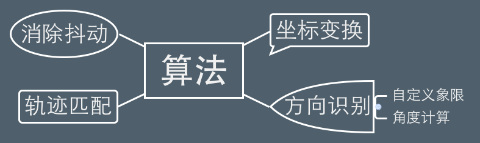
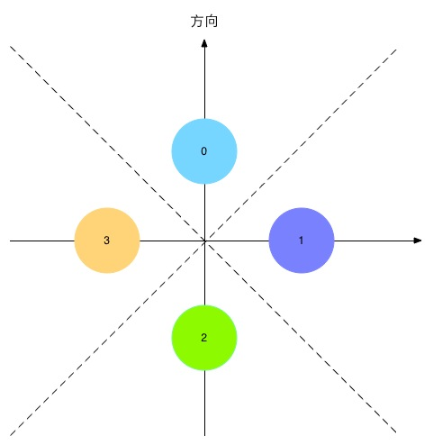

title: presentation
author:
  name: Quick Launcher 
  url: 宋艺博 王学成 庄晨帆
output: presentation.html
theme: sudodoki/reveal-cleaver-theme

--

### 汇编大作业展示
# QUICK LAUNCHER
## 鼠标手势识别
### ⬇
## 快速启动


> 宋艺博 王学成 庄晨帆

--

## What's 
# Quick Launcher 

> 识别鼠标轨迹，快速启动程序

> 支持用户添加、删除、编辑手势

--

### 操作流程


--

## 基本功能

+ 添加手势
+ 匹配手势
	* 匹配成功→启动 
	* 匹配失败→询问是否记住该手势
+ 编辑手势
+ 删除手势

<br>

> [光说不练假把式→看demo](www.baidu.com).

--

### 程序逻辑


--

听说我们要用

#神经网络BP#

来识别轨迹？

--


### 还不能实时匹配！！

> 据说人家chrome是这样的

### ⬆⬇⬅➡
--

### 核心算法




--

### 细节处理

消除鼠标抖动-->	*~~过拟合~~*

> 例如, 开始画时，手抖了一下

> 又例如，画完的时候，手又抖动了一下

####⬇

> 极小的距离产生了一个新方向 

#### 解决方案:
> 隔距离取点

--

### 坐标变换


--

### 方向识别 
#### 角度计算


获取从绿点```P0```到蓝点```P1```的移动方向 

= 向量```P0P1```与y轴所成的角度**α**

--

### 方向识别 
#### 自定义象限



方向 = **α**所落在的区域

--

### 轨迹匹配


前缀匹配，线性扫描 --> [快准狠](www.baidu.com)

--

## 亮点
#### 技术细节

+ [双缓冲防止屏幕疯狂闪烁](www.baidu.com).

--

## 亮点
#### 技术细节
+ 双缓冲防止屏幕疯狂闪烁
+ [实时方向识别、即刻动作匹配](www.baidu.com).

--

## 亮点
#### 用户体验

+ [支持选择/取消开机启动](www.baidu.com).

--

## 亮点
#### 用户体验

+ 支持选择/取消开机启动
+ [体贴的提示](www.baidu.com).

--

## 亮点
#### 用户体验

+ 支持选择/取消开机启动
+ 体贴的提示
+ [系统热键：CONTROL + Q显示/隐藏Quick Launcher](www.baidu.com).
	* [显示在所有窗口最前](www.baidu.com).

--

## 亮点
#### 用户体验
+ 支持选择/取消开机启动
+ 体贴的提示
+ 系统热键，CONTROL + Q显示/隐藏Quick Launcher
	* 显示在所有窗口最前
+ [快速添加手势](www.baidu.com).

--

## 亮点
#### 分工合作

+ git管理代码
+ [代码模块化，界面与逻辑分离，便于调试与分工](www.baidu.com).
+ 小黄鸭调试(rubber duck debugging)
--

## HAVE FUN!

# END
