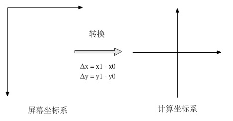
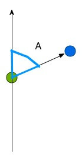

title: presentation
author:
  name: Quick Launcher 
  url: 宋艺博 王学成 庄晨帆
output: presentation.html
theme: sudodoki/reveal-cleaver-theme
--

### 汇编大作业展示
# QUICK LAUNCHER
## 鼠标手势识别
## ⬇
## 快速启动
 
> 宋艺博 王学成 庄晨帆

--

## What's 
# Quick Launcher 

> 识别鼠标轨迹，快速启动程序

> 支持用户添加、删除、编辑手势

--

## 操作流程

--

## 基本功能

+ 添加手势
+ 匹配手势
	* 匹配成功→启动 
	* 匹配失败→询问是否记住该手势
+ 编辑手势
+ 删除手势
 
[光说不练假把式→看demo](www.baidu.com).

--

## 核心算法
+ 坐标变换
+ 方向识别 
+ 轨迹匹配

--

### 坐标变换

--

### 方向识别 
#### 自定义象限

--

### 方向识别 
#### 角度计算

--

## 亮点

+ 实时方向识别、即刻动作匹配

--

## 亮点

+ 实时方向识别、即刻动作匹配
+ 支持选择/取消开机启动

--

## 亮点

+ 实时方向识别、即刻动作匹配
+ 支持选择/取消开机启动
+ 系统热键：CONTROL + Q显示/隐藏Quick Launcher
	* 显示在所有窗口最前

--

## 亮点

+ 实时方向识别、即刻动作匹配
+ 支持选择/取消开机启动
+ 系统热键，CONTROL + Q显示/隐藏Quick Launcher
	* 显示在所有窗口最前
+ 快速添加手势

--

## 亮点

+ 实时方向识别、即刻动作匹配
+ 支持选择/取消开机启动
+ 系统热键，CONTROL + Q显示/隐藏Quick Launcher
	* 显示在所有窗口最前
+ 快速添加手势
+ 代码模块化，便于调试与分工

--

# END